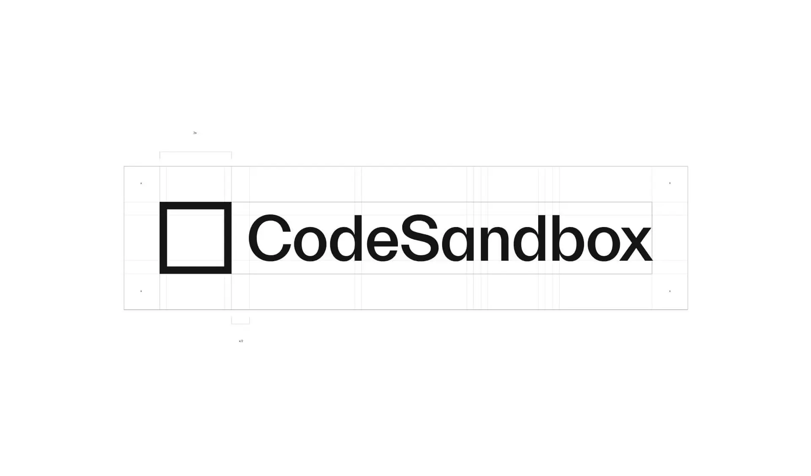
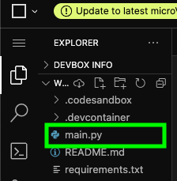
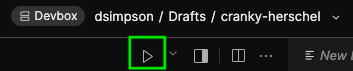
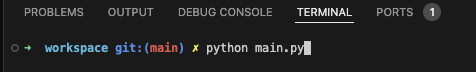

# Creating and Running Python Programs

Before we dive into our first Python topic, let's cover some essential information to help you get started with Python programming.

## How do you create a Python program?

To create a Python program, you can use any text editor or an Integrated Development Environment (IDE) to write your code. 

In this class, we will be using an online code editor called CodeSandbox. 



CodeSandbox allows you to write, run, and share Python code directly from your web browser without needing to install anything on your computer.

To create a new Python program in CodeSandbox, follow the steps outlined [here](https://docs.google.com/presentation/d/1eQ6sb9_Phf3LbiyUDlnnxVF52eUbDITb3tsR-o9HOEo/edit?usp=sharing)


You now have a new Python project set up and ready for you to start coding!

## Running Your Python Code

When you create a new Python project in CodeSandbox, it automatically sets up an environment for you to run your code.
This includes a file named "main.py", which is where you can write your Python code.



This file will have some default code in it, which you can modify or replace with your own code.

For now , let's run the default code to see how it works:

1. In the "main.py" file, you should see some code that looks like this:

```python
print("Hello CodeSandbox!")
```

2. To run the code, click the play icon located at the tab bar above the code editor that shows the current open files.



3. You can also run the code by going to the open terminal and typing `python main.py` where `main.py` is the **file path** of a python file




