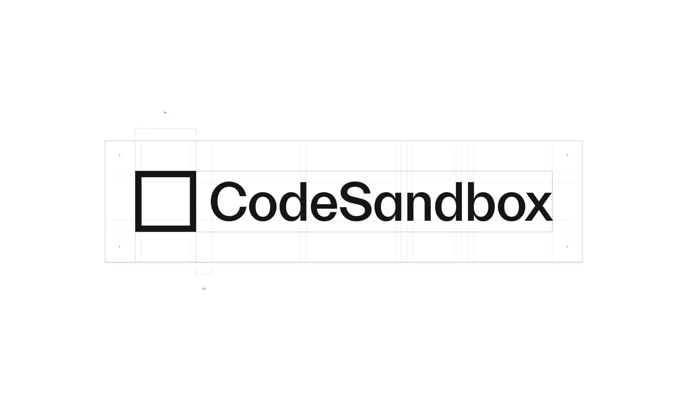
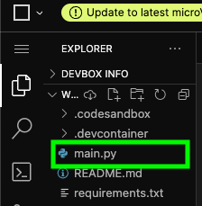
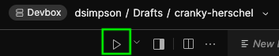
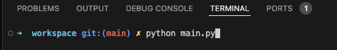

# 创建和运行 Python 程序

在深入学习第一个 Python 主题之前，我们先来介绍一些基本信息，以帮助您开始学习 Python 编程。

## 如何创建 Python 程序？

要创建 Python 程序，您可以使用任何文本编辑器或集成开发环境 (IDE) 来编写代码。

在本课中，我们将使用名为 CodeSandbox 的在线代码编辑器。



CodeSandbox 允许您直接从网络浏览器编写、运行和共享 Python 代码，而无需在计算机上安装任何设备。

要在 CodeSandbox 中创建一个新的 Python 程序，请按照 [此处](https://docs.google.com/presentation/d/1eQ6sb9_Phf3LbiyUDlnnxVF52eUbDITb3tsR-o9HOEo/edit?usp=sharing) 概述的步骤操作


现在您已经建立了一个新的 Python 项目，可以开始编码了！

## 运行你的 Python 代码

当您在 CodeSandbox 中创建一个新的 Python 项目时，它会自动为您设置一个运行代码的环境。
这包括一个名为 "main.py "的文件，您可以在其中编写 Python 代码。



该文件将包含一些默认代码，您可以修改或替换为自己的代码。

现在，让我们运行默认代码，看看它是如何工作的：

1.在 "main.py "文件中，你应该能看到如下代码：


```python
print("Hello CodeSandbox!")
```

2.要运行代码，请单击代码编辑器上方显示当前打开文件的标签栏中的播放图标。



3.您也可以通过打开终端并输入 `python main.py`来运行代码，其中 `main.py` 是 python 文件的**文件路径**。

